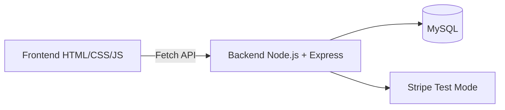

# Full Stack Game Store Application

A full-stack game store web app with a decoupled frontend, REST API backend, MySQL persistence, JWT authentication, and Stripe test-mode checkout.

- Source code: [itcs212_web-server](https://github.com/Purinat33/itcs212_web-server)
- Tech focus: frontend-backend independence, auth security basics, payment flow design, relational data modeling

> If I had 30 seconds to explain this project: I built an e-commerce-style flow (browse → cart → checkout) with a separate frontend and backend communicating via HTTP, including user authentication and test payments.

---

## Project at a glance

| Item                   | Details                                                                              |
| ---------------------- | ------------------------------------------------------------------------------------ |
| Type                   | Full-stack web application (class project)                                           |
| Architecture           | Decoupled frontend + REST API backend                                                |
| Backend                | Node.js (Express), MySQL                                                             |
| Auth                   | bcrypt password hashing + JWT                                                        |
| Payments               | Stripe test mode (mock / sandbox payments)                                           |
| What this demonstrates | API design, security fundamentals, database integration, end-to-end feature delivery |

---

## Overview

I developed a full-stack web application where the **frontend and backend are fully independent** and communicate through HTTP requests (Fetch API). The app supports:

- User registration and login with **JWT-based authentication**
- Protected routes for authenticated actions
- Cart and checkout flow with **Stripe test-mode payments**
- Persistent storage with **MySQL** for users, products, and cart data

---

## Architecture



### Why this architecture?

Keeping the frontend and backend separate makes the project more realistic and scalable:

- The backend can serve multiple clients (web, mobile, admin tool).
- API endpoints become a clean contract.
- UI changes don’t require server rewrites (and vice versa).

---

## Tech stack

### Frontend

- HTML, CSS, JavaScript
- Fetch API for async requests to backend endpoints

### Backend

- Node.js (Express) for routing and business logic
- MySQL for relational storage
- bcrypt.js + JWT for auth
- Stripe test mode for checkout session creation

---

## Key features (with engineering decisions)

## 1) Frontend–backend independence via Fetch API

The frontend sends JSON to the backend and handles responses cleanly. Example: registration call.

```javascript
const response = await fetch("http://localhost:80/auth/register", {
  method: "POST",
  headers: { "Content-Type": "application/json" },
  body: JSON.stringify({ username, password }),
});

const data = await response.json();
if (!response.ok) {
  // Display a user-friendly message instead of failing silently
  console.error(data.message || "Registration failed");
}
```

**What this shows**

- You understand client/server boundaries
- You can build an API-driven UI (a common real-world pattern)
- You’re thinking about error handling, not just the happy path

---

## 2) Authentication and protected routes (JWT + bcrypt)

### Auth flow

1. **Register**: hash the password, store hash in MySQL
2. **Login**: verify password, issue JWT
3. **Protected endpoints**: require a valid token

Example query used for login/user lookup:

```sql
SELECT * FROM users WHERE username = ?;
```

**What I’d highlight to an employer**

- Passwords are never stored in plain text (bcrypt hashing)
- JWT enables stateless authentication for protected routes
- This pattern scales better than session storage for simple APIs

> Note: In a production version, I would tighten token handling (expiry strategy, refresh tokens, secure storage such as httpOnly cookies, and rate limiting on auth endpoints).

---

## 3) Checkout with Stripe test-mode (mock payments)

I implemented a checkout flow by converting cart items into Stripe line items and creating a checkout session.

```javascript
const createCheckoutSession = async (req, res) => {
  const uid = req.params.uid;

  const items = await db.promise().query(
    `
    SELECT
      product.id,
      product.name,
      product.publisher,
      product.price,
      cart.quantity
    FROM 
      cart
      INNER JOIN product ON cart.pid = product.id
    WHERE
      cart.uid = ?
  `,
    [uid]
  );

  const lineItems = items[0].map((item) => ({
    price_data: {
      currency: "thb",
      product_data: {
        name: item.name,
        description: item.publisher,
      },
      unit_amount: item.price * 100,
    },
    quantity: item.quantity,
  }));

  const session = await stripe.checkout.sessions.create({
    payment_method_types: ["card"],
    line_items: lineItems,
    mode: "payment",
    success_url: `http://localhost:3000/pay/success`,
    cancel_url: `http://localhost:3000/pay/cancel`,
  });

  res.json({ id: session.id });
};
```

**What this shows**

- You can model real e-commerce flows (cart → checkout session)
- You can map relational DB results into external API payloads
- You understand currency/amount conversion details (e.g., multiplying by 100)

---

## 4) MySQL integration (persistent data + joins)

This project uses MySQL for persistence and relational modeling across users, cart, and products. The join in the checkout function is a good example of building a useful data view for a business action (checkout).

**Why it matters**

- Real apps live and die on clean data modeling
- Joins and query structure show you can work beyond “toy” CRUD

---

## Challenges (and how I handled them)

- **Keeping frontend and backend decoupled**

  - Solved by using consistent JSON request/response shapes and predictable endpoints.

- **Auth across multiple protected actions**

  - Solved by using JWT and middleware-style checks (token required for protected routes).

- **Checkout data accuracy**

  - Solved by building line items directly from the database cart (source of truth).

---

## Future improvements

If I continued this project, I would add:

- **Two-Factor Authentication (2FA)** for stronger account security
- **WebSockets** (or SSE) for real-time updates (inventory changes, order status)
- **Better production hardening**

  - input validation (server-side schema validation)
  - rate limiting on auth endpoints
  - structured error responses and logging

- **Deployment**

  - environment variables for secrets
  - containerization (Docker) and cloud deployment

---

## How to run (high level)

1. Clone the repo: [itcs212_web-server](https://github.com/Purinat33/itcs212_web-server)
2. Configure environment variables (DB credentials, JWT secret, Stripe keys)
3. Run backend and frontend separately (decoupled by design)
4. Test auth flow and Stripe test checkout

---

## Conclusion

This project demonstrates full-stack fundamentals with an API-first approach: a separate frontend, a Node/Express backend, secure authentication basics, database-driven features, and a test payment flow. The main engineering goal was clean separation and realistic end-to-end behavior.

---
