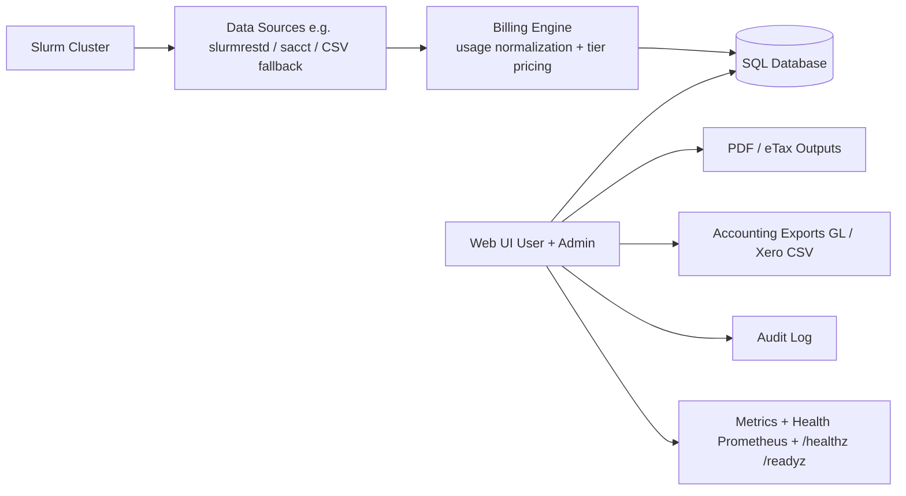

# High Power Computing Cluster Cost Calculator Webapp

A Flask-based web application made for Mahidol University AI Center that turns **Slurm job usage** into **tiered, auditable billing** (invoices/receipts + PDF/eTax), and produces **accounting-ready exports** (GL + Xero-style CSV) with operational guardrails (audit log, metrics, health checks).

- Repo: https://github.com/Purinat33/hpc_flask

> 30-second pitch: “Usage from Slurm → costed by tier → receipts/invoices → payment + accounting postings → signed exports. Built for transparency, traceability, and ‘don’t double-bill’ safety.”

---

## Project at a glance

| Item       | Details                                                                                                    |
| ---------- | ---------------------------------------------------------------------------------------------------------- |
| Problem    | HPC centers need transparent cost recovery + clean accounting outputs from scheduler usage data            |
| Inputs     | Slurm job data (slurmrestd / sacct / CSV fallback)                                                         |
| Core logic | Normalize job IDs → compute CPU/GPU/Mem-hour usage → apply tiered rates → generate line items + totals     |
| Backend    | Python (Flask), SQLAlchemy                                                                                 |
| Outputs    | Receipts/invoices (web + PDF), eTax artifacts, CSV exports (usage, paid receipts, posted GL, Xero formats) |
| Ops        | Auth controls + CSRF, audit trail, Prometheus metrics, health/ready endpoints                              |

---

## Why I built this

Scheduler usage data is usually _there_, but turning it into something **finance/admin teams can trust** is the hard part:

- usage completeness (steps vs parent jobs)
- pricing policy (tiers, overrides, rate changes)
- billing lifecycle (issued → paid → reversed)
- accounting/export integrity (reproducible files, traceable evidence)

This project focuses on the “last mile” between HPC operations and accounting.

---

## Architecture

---

## Key features (with the “why”)

### 1) Usage ingestion with safety fallbacks

- Pulls job usage from **multiple sources**, so the app can still operate in dev/test or when an upstream feed fails.
- Normalizes job IDs so step rows don’t cause double counting.

**Why it matters:** billing is only as trustworthy as the “source of truth” pipeline.

---

### 2) Tiered pricing + per-user overrides

- Pricing is rate-based (CPU-hour / GPU-hour / Mem GB-hour) per tier.
- Supports explicit tier overrides for special cases (e.g., a user billed as “gov” instead of “private”).

**Why it matters:** pricing rules change over time and aren’t always uniform.

---

### 3) Invoice/receipt lifecycle that matches real operations

- Generate receipts from a date window (e.g., monthly).
- Lock rate snapshots at issuance time so historical totals remain stable even if rates later change.
- Admin can mark as paid and (when needed) revert with traceable reasons.

**Why it matters:** “billing” isn’t just a calculation—there’s a lifecycle and audit requirements.

---

### 4) Accounting outputs (not just a spreadsheet dump)

- Produces **posted-ledger exports** and finance-friendly CSVs.
- Supports export runs with reproducibility in mind (same selection → same file), plus evidence/manifest artifacts.

**Why it matters:** exports must be dependable, repeatable, and explainable.

---

### 5) Audit, security, and ops readiness

- Admin routes are protected; sensitive actions require stronger session freshness.
- CSRF protection for form actions.
- Audit logging for export/billing actions.
- Prometheus metrics + health endpoints for container/K8s-style deployment.

**Why it matters:** billing systems are high-trust systems—controls matter.

---

## What I’d highlight to an employer

- **Data engineering + product thinking:** taking messy operational data (scheduler usage) and turning it into a finance-grade workflow.
- **Controls-first mindset:** preventing double billing, locking rate snapshots, reversible flows with audit.
- **Full-stack delivery:** real UI screens + exports + PDFs + operational endpoints, not just a script.

---

## How to run (high level)

1. Configure environment variables (examples):

   - `FLASK_SECRET_KEY`
   - `DATABASE_URL`
   - `SLURMRESTD_URL` / `SLURMRESTD_TOKEN` (optional)
   - `FALLBACK_CSV` (dev/test)

2. Start services (Docker Compose recommended).
3. Log in as user/admin and test:

   - usage view → receipt creation → paid → exports

---

## Future improvements

- Add role-based approvals for rate changes (4-eyes principle)
- Add stronger validation rules for “period close” workflows
- Add background jobs for scheduled monthly invoice generation
- Expand scheduler adapters (PBS, LSF) via a pluggable data-source layer

---
